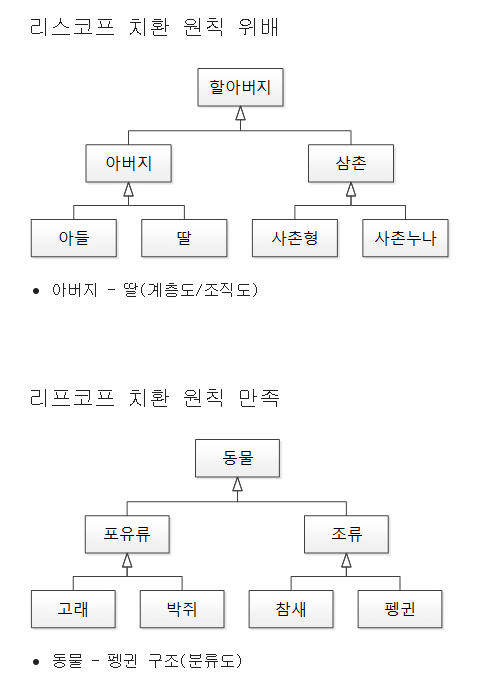

#  좋은 객체 지향 설계의 5가지 원칙

- SRP: 단일 책임 원칙(single responsibility principle)

- OCP: 개방-폐쇄 원칙 (Open/closed principle)

- LSP: 리스코프 치환 원칙 (Liskov substitution principle)

- ISP: 인터페이스 분리 원칙 (Interface segregation principle)

- DIP: 의존관계 역전 원칙 (Dependency inversion principle

## 1.SRP 단일 책임 원칙

- 한 클래스는 하나의 책임만 가져야 한다.
- 클라이언트 객체는 직접 구현 객체를 생성하고, 연결하고, 실행하는 다양한 책임을 가지고 있음
- SRP 단일 책임 원칙을 따르면서 관심사를 분리함
- 구현 객체를 생성하고 연결하는 책임은 AppConfig가 담당
- 클라이언트 객체는 실행하는 책임만 담당

## 2. DIP 의존관계 역전 원칙

- 프로그래머는 “추상화에 의존해야지, 구체화에 의존하면 안된다.” 의존성 주입은 이 원칙을 따르는 방법 중
하나다.
- 새로운 할인 정책을 개발하고, 적용하려고 하니 클라이언트 코드도 함께 변경해야 했다. 왜냐하면 기존
클라이언트 코드( OrderServiceImpl )는 DIP를 지키며 DiscountPolicy 추상화 인터페이스에
의존하는 것 같았지만, FixDiscountPolicy 구체화 구현 클래스에도 함께 의존했다.
- 클라이언트 코드가 DiscountPolicy 추상화 인터페이스에만 의존하도록 코드를 변경했다.
하지만 클라이언트 코드는 인터페이스만으로는 아무것도 실행할 수 없다.
- AppConfig가 FixDiscountPolicy 객체 인스턴스를 클라이언트 코드 대신 생성해서 클라이언트
코드에 의존관계를 주입했다. 이렇게해서 DIP 원칙을 따르면서 문제도 해결했다.

## 3. OCP

- 소프트웨어 요소는 확장에는 열려 있으나 변경에는 닫혀 있어야 한다
- 다형성 사용하고 클라이언트가 DIP를 지킴
- 애플리케이션을 사용 영역과 구성 영역으로 나눔
- AppConfig가 의존관계를 FixDiscountPolicy RateDiscountPolicy 로 변경해서 클라이언트
- 코드에 주입하므로 클라이언트 코드는 변경하지 않아도 됨
- 소프트웨어 요소를 새롭게 확장해도 사용 영역의 변경은 닫혀 있다
## 4. LSP 리스코프 치환 원칙

- 서브 타입은 언제나 자신의 기반 타입으로 교체할 수 있어야 한다. - 로버트 C.마틴

## 5. ISP 인터페이스 분리 원칙

- 클라이언트는 자신이 사용하지 않는 메소드에 의존 관계를 맺으면 안 된다. - 로버트 C.마틴 

